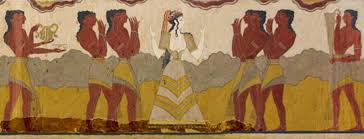
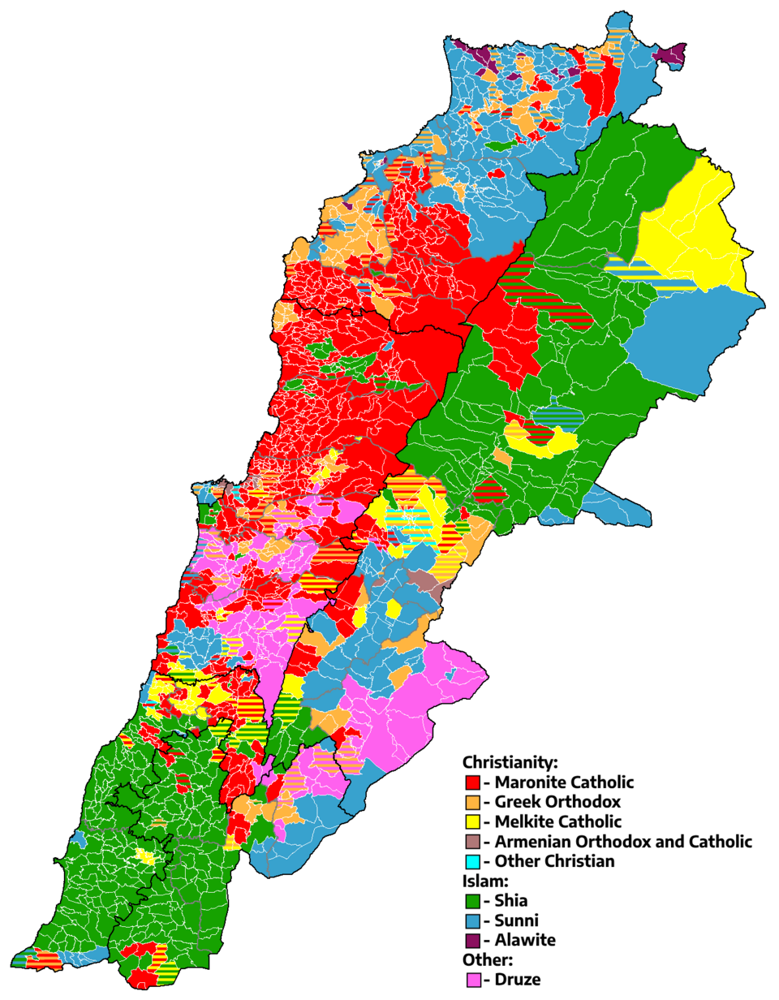

# Lebanon History Presentation 🇱🇧

A visual guide to Lebanon’s history, from the Phoenicians to modern times.

---

## 📌 Phoenicians (1550–300 BC)

**Fun facts:**
- Invented the first alphabet — the OG texting system.  
- Masters of trade across the Mediterranean.  
- Famous for purple dye, more expensive than gold back then.

**Phoenician trade map:**

---

## 📌 Ottoman Era (1516–1918)

**Fun facts:**
- Lebanon was a semi-autonomous region under the Ottoman Empire.  
- Beirut grew as a trade hub.  
- Cedars of Lebanon started getting protection because Europeans kept cutting them.

---

## 📌 French Mandate / Modern Lebanon

  
  

**Fun facts:**
- Modern borders drawn in 1920 under French Mandate.  
- Independence in 1943 with the National Pact.  
- Beirut was called the “Paris of the Middle East” for culture and nightlife.

---

## 📌 Lebanese Civil War (1975–1990)

**Fun facts:**
- Lasted 15 years with 25+ factions.  
- Downtown Beirut split by the Green Line.  
- Ended with the Taif Agreement → rebuilt political system.

---

## 🎨 Notes

- All images are in the `images/` folder.  
- Filenames are lowercase with hyphens to avoid broken links.  
