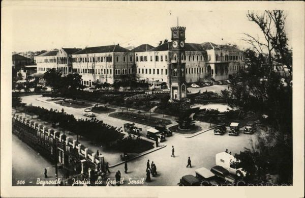
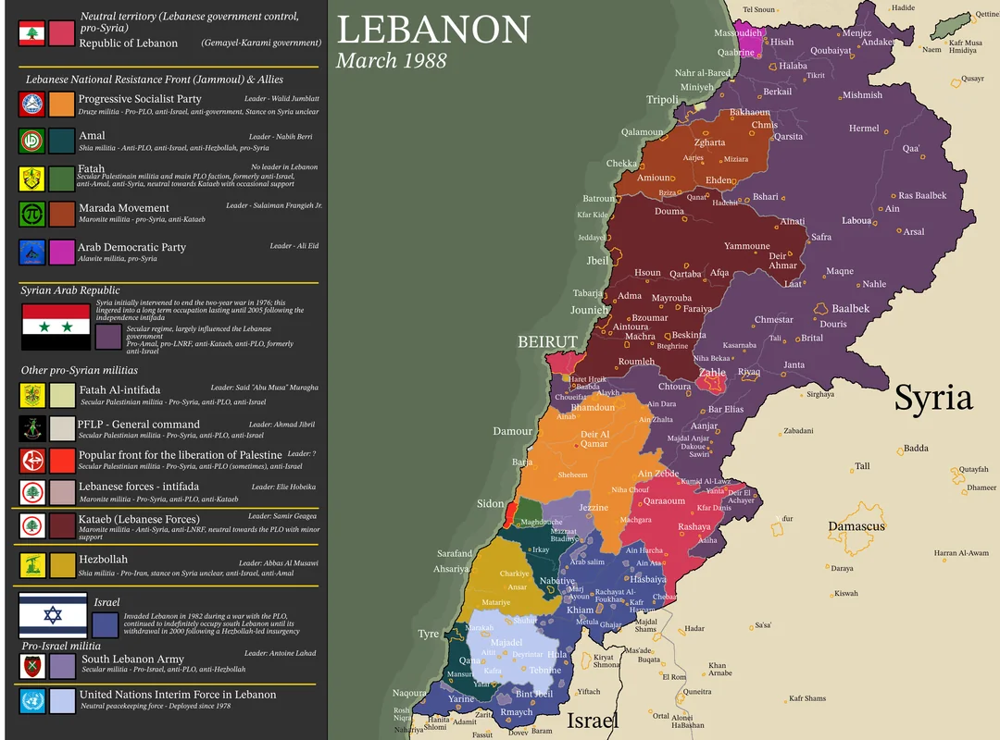

# Lebanon — History & Culture Overview

This repository contains a complete timeline of Lebanon’s history for presentation purposes, from the Phoenicians to modern Lebanon.

---

## 📜 Summary Timeline

### Phoenicians (3000–539 BC)

- Ancient seafarers, created the first alphabet, famous for Tyrian purple dye and Mediterranean trade.

### Ottoman Era (1516–1918)

- Ma‘an & Shihab dynasties ruled; sectarian tensions; 1860 civil conflict; Mutasarrifate system introduced.

### French Mandate (1920–1943)

- Greater Lebanon created; Constitution of 1926; French language & infrastructure; rise of independence movement.

### Independence (1943)

- National Pact; full sovereignty; power-sharing among religious communities.

### Civil War (1975–1990)

- Sectarian conflict; foreign interventions; Taif Agreement; reconstruction began post-war.

### Modern Era (1990–Present)

- Rebuilding Beirut; Cedar Revolution; political and economic crises; cultural preservation and ongoing challenges.

---

## 🌟 Famous Lebanese Figures

### **Gibran Khalil Gibran (1883–1931)**

- Poet, writer, philosopher.
- Famous quotes:
  - *"Your children are not your children. They are the sons and daughters of Life's longing for itself."*
  - *"Out of suffering have emerged the strongest souls; the most massive characters are seared with scars."*

### **Fakhr al-Din II (1572–1635)**
- Ottoman-era leader, modernized Lebanon, allied with Europe.

### **Bechara El Khoury (1890–1964)**
- First President of independent Lebanon.

### **Riad Al Solh (1894–1951)**
- First Prime Minister of independent Lebanon.

### **Other Notable Figures**
- Said Akl — poet and linguist  
- Khalil Sakakini — educator and reformist  

---

## 🔗 References
- Phoenicians: https://en.wikipedia.org/wiki/Phoenicia  
- Ottoman Lebanon: https://en.wikipedia.org/wiki/Ottoman_Lebanon  
- French Mandate: https://en.wikipedia.org/wiki/French_Mandate_for_Syria_and_Lebanon  
- Independence: https://en.wikipedia.org/wiki/Lebanon#Independence  
- Civil War: https://en.wikipedia.org/wiki/Lebanese_Civil_War  
- Modern Lebanon: https://en.wikipedia.org/wiki/Lebanon  

